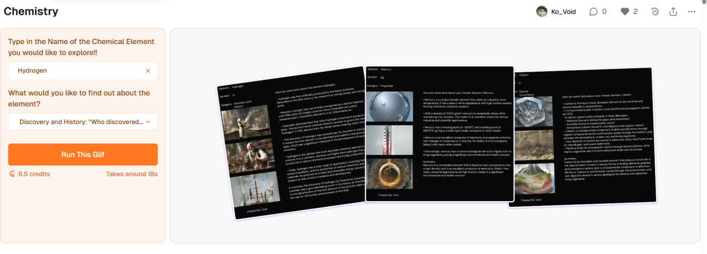
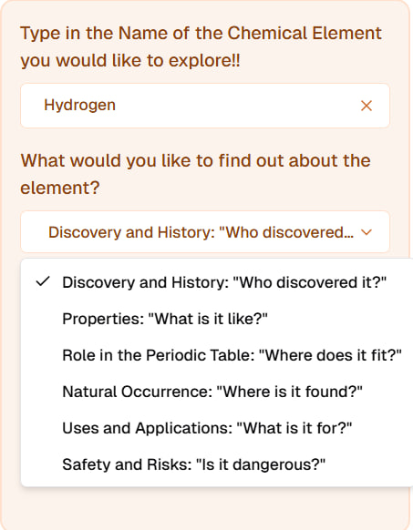
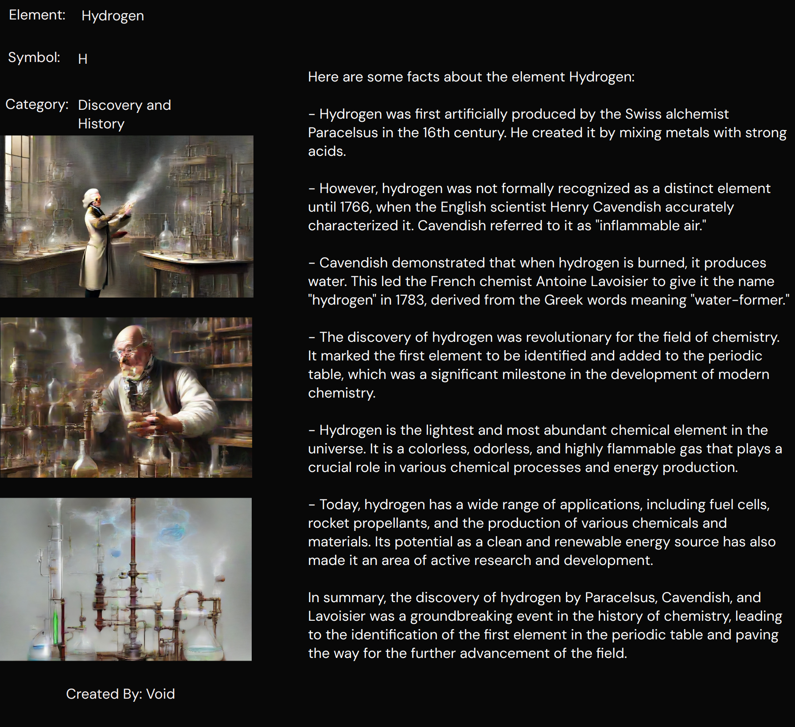

# 🔬 Chemical Element Explorer – Powered by Glif.app

This project is an interactive AI-powered mini-app built with [Glif.app](https://glif.app), allowing users to explore chemical elements in an engaging, educational format. With the help of a Large Language Model (LLM) and intelligent visual generation, users can learn about any element from multiple perspectives.

---

## How It Works

1. **Input**  
   The user types the name of any **chemical element** they wish to explore (e.g., "Oxygen", "Gold").

2. **Choose Topics of Interest**  
   The user selects from multiple exploration categories:
   - 🧑‍🔬 *Discovery and History*: "Who discovered it?"
   - 🔬 *Properties*: "What is it like?"
   - 🧩 *Role in the Periodic Table*: "Where does it fit?"
   - 🌍 *Natural Occurrence*: "Where is it found?"
   - 🛠️ *Uses and Applications*: "What is it for?"
   - ⚠️ *Safety and Risks*: "Is it dangerous?"

3. **Results**  
   The app dynamically generates:
   - Informative text powered by LLMs
   - JSON structure to organize data
   - Three related images to enhance visual learning
   - A refined image prompt, enhanced by the LLM
   - A **canvas-based visual layout** for a clean interactive summary

---

## 🧠 Powered Workflow

Here's how the Glif app is structured behind the scenes:

`Text Input` → `Multi-Pick Options` → `LLM Text Generator` → `JSON Extractor` → `3 Related Images` → `LLM Prompt Enhancer` → `Canvas Visual Layout`

---

## Preview

### 1. Input

### 2. Block sequences

### 3. Layout Design

### 4. Example output

---

##  Technologies & Skills Used

- Prompt Engineering (LLM-based)
- No-Code Visual Workflow (Glif.app)
- JSON Structuring & Data Parsing
- Visual UX with Canvas Elements
- Scientific Content Generation

---

## 🌐 Try It Out

👉 [Run this Glif](https://glif.app/@Ko_Void/glifs/cm46pq65c003okjpxs1125fzb)

---

## 🙋 Author

By **Hein Pyae Sone Htet**

